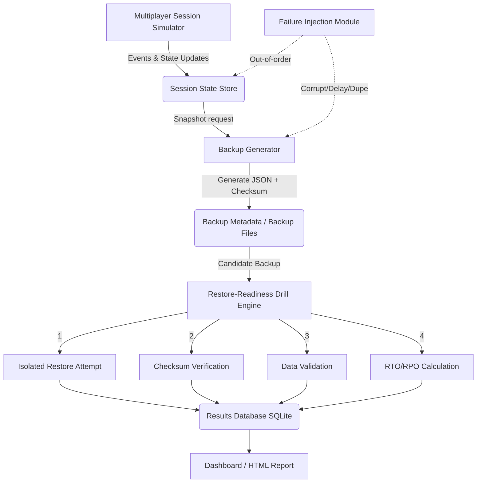

# AUTOMATED RESTORE-READINESS DRILL ARCHITECTURE

## Overview
The architecture is designed to continuously simulate multiplayer session changes, periodically snapshot backups, and subsequently run an automated engine to restore and validate those backups.

## Diagram

## Components
1. **Multiplayer Session Simulator:** Generates continuous JSON records of player joins, leaves, and score changes.
2. **Backup Generator:** Snapshots the simulated state and computes SHA-256 checksums.
3. **Restore-Readiness Drill Engine:** The core coordinator. Automates the deployment of backups into an isolated test space.
4. **Validation Service:** Compares the restored records against the pre-failure original records.
5. **Failure Injection:** Introduces chaos (corrupted checksums, duplicated events) to ensure the engine detects faults properly.
